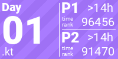
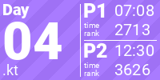

# KotlinAdventOfCode

<!-- AOC TILES BEGIN -->
<h1 align="center">
  2022 - 44 ⭐
</h1>

<!-- AOC TILES END -->

##### Made with help of [LiquidFun][aocTiles] AOC repository
--- 

Welcome to the Advent of Code[^aoc] Kotlin project created by [vladuken][github] using
the [Advent of Code Kotlin Template][template] delivered by JetBrains.

In this repository, vladuken is about to provide solutions for the puzzles using [Kotlin][kotlin]
language.

If you're stuck with Kotlin-specific questions or anything related to this template, check out the
following resources:

- [Kotlin docs][docs]
- [Kotlin Slack][slack]
- Template [issue tracker][issues]

[^aoc]: [Advent of Code][aoc] – An annual event of Christmas-oriented programming challenges started
December 2015. Every year since then, beginning on the first day of December, a programming puzzle
is published every day for twenty-five days. You can solve the puzzle and provide an answer using
the language of your choice.

[aocTiles]: https://github.com/LiquidFun/adventofcode

[aoc]: https://adventofcode.com

[docs]: https://kotlinlang.org/docs/home.html

[github]: https://github.com/vladuken

[issues]: https://github.com/kotlin-hands-on/advent-of-code-kotlin-template/issues

[kotlin]: https://kotlinlang.org

[slack]: https://surveys.jetbrains.com/s3/kotlin-slack-sign-up

[template]: https://github.com/kotlin-hands-on/advent-of-code-kotlin-template
